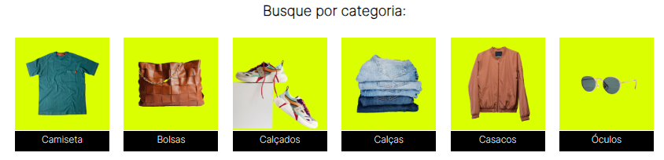
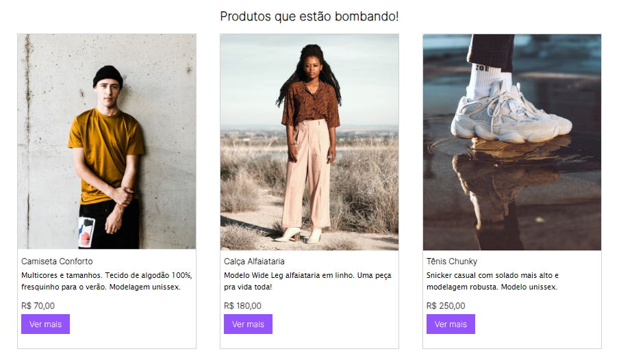
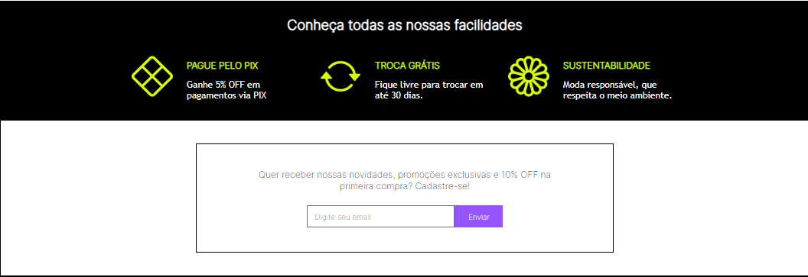
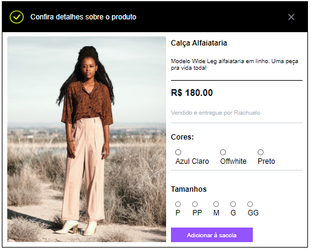
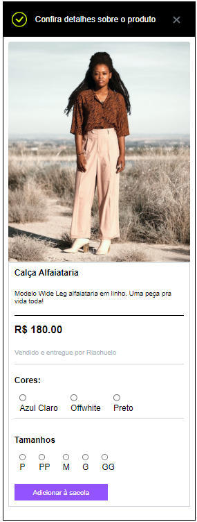

# Loja-Meteora

Brm-bindo a loja Meteora! 

Um loja de roupas com funcionalidades, raponsividade e acessivel para ambientes mobile. 

Utilizando HTML, CSS e JavaScript, foi possivel criar uma interface interativa. 

**Visualize e brinque com o carousel:**

**Explore categorias:**

**Explore o catálago**

**Visualize facilidades, interaja com o envio de emai:**

**Clique em 'ver mais' e abra a janela para selecionar a cor e o tamaho:**

**Tambem no ambiente mobilide:**

## Visite o site: <a href='https://anasouza.top/src_03/index.html'>Clique aqui</a>
